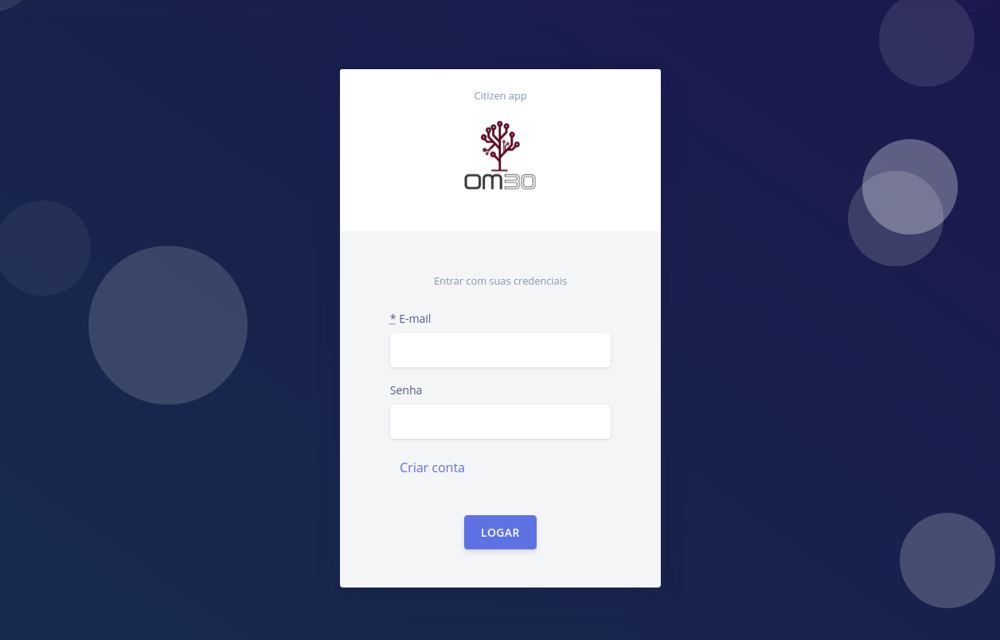

# Citizen App

Um sistema simples para cadastro e consulta de municipes com envio de email quando incluido e alterado.
Projeto desenvolvido com ruby on rails.

## Demonstração

Acesse [Citizen app](https://municipe.herokuapp.com) e
crie um usuário para começar.

### Desenvolvimento
* Desenvolvido com **ruby on rails** na versão **2.6.7 ~ 5.2.6**.

* Usando o **UI KIT** [Argon design](https://demos.creative-tim.com/argon-design-system/index.html)

* Banco de dados **Postgresql 12.7** com **ActiveRecord**

* Autenticação com [Devise](https://github.com/heartcombo/devise)

* Consultas com [Ransack](https://github.com/activerecord-hackery/ransack)

* Email com **Google SMTP**

### Testes
* [rspec-rails](https://github.com/rspec/rspec-rails), [shoulda-matchers](https://github.com/thoughtbot/shoulda-matchers), 
[rails-controller-testing](https://github.com/rails/rails-controller-testing), [capybara](https://github.com/teamcapybara/capybara), [FFaker](https://github.com/ffaker/ffaker), [factory-bot-rails](https://github.com/thoughtbot/factory_bot_rails) e [simplecov](https://github.com/simplecov-ruby/simplecov).

Para rodar os testes utilize: `rspec`

## Contribuição

Para contribuir com o projeto ou experimentar por conta própria siga estes passos:

1. Clone o repositório com `git@github.com:marcelo-henrique-sousa/municipe.git`

2. entre na pasta `cd municipe_crud`

3. instale as dependencias com `bundle install`

4. configure o `database.yml` de acordo com o seu usuário e senha do banco de dados.

5. no console rode as migrations `rails db:create && rails db:migrate`

6. suba o servidor com `rails s`

7. veja no navegador `http://localhost:3000`

* pare o app com `Ctrl + c` no terminal

## Desenvolvido por
[Marcelo henrique](https://github.com/marcelo-henrique-sousa).
